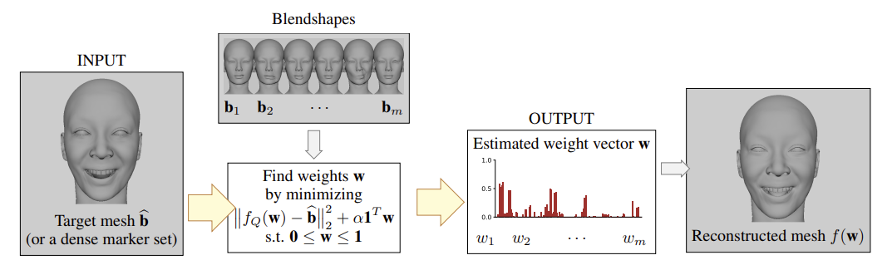

This repository covers the work of several scientific papers in the field of blendshape animation of the human face, that together build my PhD thesis, titled "...".

## LMMM - Levenberg–Marquardt Majorization-Minimization-based Solution


THis chapter consists of two papers, solving the inverse rig problem on a base of Majorization-Minimization, in order to simplify originally complex, nonconvex objectives. the corresponding scripts can be found in ../Scripts/LMMM repo.

#### A Majorization-Minimization-Based Method for Nonconvex Inverse Rig Problems in Facial Animation: Algorithm Derivation

https://link.springer.com/article/10.1007/s11590-023-02012-w

This paper gives a mathematical derivation of the algorithm, with convergence guarantees. 

```bibtex
@article{rackovic2024majorization,
  title={A majorization--minimization-based method for nonconvex inverse rig problems in facial animation: algorithm derivation},
  author={Rackovi{\'c}, Stevo and Soares, Cl{\'a}udia and Jakoveti{\'c}, Du{\v{s}}an and Desnica, Zoranka},
  journal={Optimization Letters},
  volume={18},
  number={2},
  pages={545--559},
  year={2024},
  publisher={Springer}
}
```

#### Accurate and Interpretable Solution of the Inverse Rig for Realistic Blendshape Models with Quadratic Corrective Terms

https://arxiv.org/abs/2302.04843

Complementing the previous paper, this one quantitatively explores the results and benchmarks the algorithm with SOTA approaches over animated sequences. 

```bibtex
@article{rackovic2023accurate,
  title={Accurate and Interpretable Solution of the Inverse Rig for Realistic Blendshape Models with Quadratic Corrective Terms},
  author={Rackovi{\'c}, Stevo and Soares, Cl{\'a}udia and Jakoveti{\'c}, Du{\v{s}}an and Desnica, Zoranka},
  journal={arXiv preprint arXiv:2302.04843},
  year={2023}
}
```

## Coordinate Descent

Opposed to the first chapter, the second one approaches the problem in coordinate-wise manner, allowing for incorporation of higher-order corrective terms. The scripts for this are in ../Scripts/CoordinateDescent, and the corresponding paper is: 


#### High-fidelity Interpretable Inverse Rig: An Accurate and Sparse Solution Optimizing the Quartic Blendshape Model

https://arxiv.org/abs/2302.04843

```bibtex
@article{rackovic2023high,
  title={High-fidelity interpretable inverse rig: An accurate and sparse solution optimizing the quartic blendshape model},
  author={Rackovi{\'c}, Stevo and Soares, Cl{\'a}udia and Jakoveti{\'c}, Du{\v{s}}an and Desnica, Zoranka},
  journal={arXiv preprint arXiv:2302.04820},
  year={2023}
}
```

## Distributed Solution 

This chapter includes two papers, and corresponding scripts are in ../Scripts/DistributedSolution repo.

 #### Clustering of the Blendshape Facial Model
 
 https://ieeexplore.ieee.org/abstract/document/9616061

 This paper clusters the blendshape face into semantically meaningful segments, allowing for a distributed approach to solving the inverse rig problem. 
 
 ```bibtex
 @inproceedings{rackovic2021clustering,
  title={Clustering of the blendshape facial model},
  author={Rackovi{\'c}, Stevo and Soares, Cl{\'a}udia and Jakoveti{\'c}, Du{\v{s}}an and Desnica, Zoranka and Ljubobratovi{\'c}, Relja},
  booktitle={2021 29th European Signal Processing Conference (EUSIPCO)},
  pages={1556--1560},
  year={2021},
  organization={IEEE}
}
```

#### Distributed Solution of the Blendshape Rig Inversion Problem

https://dl.acm.org/doi/abs/10.1145/3610543.3626166

This is a further development of the above paper that incorporates the ADMM paradigm to improve the estimates of the overlapping segment components.

```bibtex
@incollection{rackovic2023distributed,
  title={Distributed Solution of the Blendshape Rig Inversion Problem},
  author={Rackovi{\'c}, Stevo and Soares, Cl{\'a}udia and Jakoveti{\'c}, Du{\v{s}}an},
  booktitle={SIGGRAPH Asia 2023 Technical Communications},
  pages={1--4},
  year={2023}
}
```

## Time-aware Components

Finally, the last chapter covers time dependencies of the animation sequences, aiming at smooth and semantically correct animation reconstruction. The corresponding scripts are in ../Scripts/TimeAwareComponent repo.

#### Refined Inverse Rigging: A Balanced Approach to High-fidelity Blendshape Animation

https://dl.acm.org/doi/full/10.1145/3680528.3687670

```bibtex
@inproceedings{10.1145/3680528.3687670,
author = {Rackovi\'{c}, Stevo and Jakoveti\'{c}, Du\v{s}an and Soares, Cl\'{a}udia},
title = {Refined Inverse Rigging: A Balanced Approach to High-fidelity Blendshape Animation},
year = {2024},
isbn = {9798400711312},
publisher = {Association for Computing Machinery},
address = {New York, NY, USA},
url = {https://doi.org/10.1145/3680528.3687670},
doi = {10.1145/3680528.3687670},
booktitle = {SIGGRAPH Asia 2024 Conference Papers},
articleno = {45},
numpages = {9},
keywords = {blendshape animation, inverse rig problem, face segmentation},
location = {Tokyo, Japan},
series = {SA '24}
}
```

